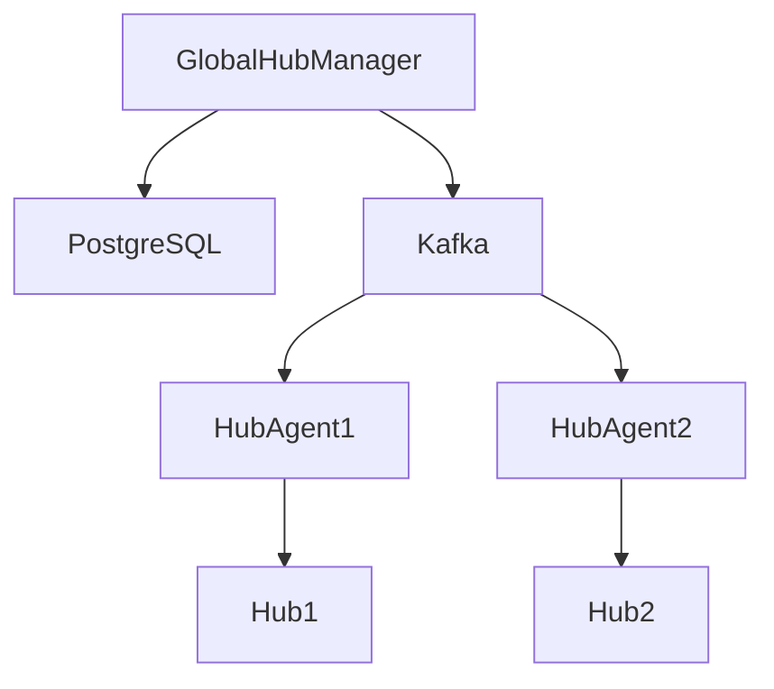

## Public Cloud, Private Cloud e Hybrid Cloud

### Capire il contesto prima di parlare di RHACM

Ragazzi, prima di entrare in RHACM, dobbiamo capire *dove vive* Kubernetes nelle aziende reali.
Oggi non esiste quasi nessuna azienda che sia 100% on-prem o 100% public cloud. La realtà è ibrida, distribuita, regolamentata, vincolata da costi e sicurezza. RHACM nasce proprio per governare questa complessità.

---

## 1. Public Cloud

Quando parliamo di public cloud intendiamo provider come AWS, Azure, Google Cloud: infrastruttura e servizi accessibili a chiunque, su richiesta, pagando solo ciò che si usa.

**I vantaggi sono enormi:**

* Scalate un’applicazione in minuti, non settimane.
* Non comprate server, non fate investimenti iniziali: tutto è pay-per-use.
* Avete servizi già pronti per AI, machine learning, database gestiti, storage distribuito globale.
* Potete distribuire l’applicazione in data center in tutto il mondo.

Per applicazioni nuove, nate per il cloud (le cosiddette *cloud-native*), il public cloud è spesso la scelta più rapida e naturale.

**Ma… non basta da solo. Perché?**

Perché le aziende reali hanno:

* **Workload che non possono muovere**: macchinari industriali, sistemi fisici, applicazioni proprietarie non containerizzate.
* **Costi di migrazione alti**: spesso bisogna riscrivere l’app per renderla cloud-native.
* **Software legacy incompatibile**: monoliti, applicazioni che non scalano orizzontalmente, stack vecchi.
* **Regolamenti stringenti**: GDPR, normative bancarie, dati sanitari, dati sensibili che *non possono lasciare il paese*.
* **Esigenza di controllo e sicurezza**: nel public cloud voi non vedete né toccate l’hardware, ed è normale che un’azienda voglia più controllo.
* **Costi imprevedibili su larga scala**: un’cluster Kubernetes che cresce senza governance può generare bollette ingestibili.

📌 Concetto chiave da ricordare:

> Il public cloud è potente, ma non universale e non applicabile a ogni workload aziendale.

---

## 2. Private Cloud

Il private cloud porta gli stessi concetti del public cloud, ma in un ambiente *privato*, controllato dall’azienda: nel proprio data center, o in un’infrastruttura dedicata, non condivisa con altri clienti.

**Perché le aziende costruiscono private cloud?**

* Per tenere **dati regolamentati o sensibili** sotto controllo.
* Per gestire **workload critici** con requisiti di sicurezza, isolamento, audit, compliance.
* Per avere **controllo completo della piattaforma**.

E qui entra OpenShift: è uno degli esempi più diffusi di *piattaforma enterprise per private cloud*, perché fornisce:

* Self-service provisioning (gli sviluppatori chiedono risorse da soli)
* Autoscaling
* Efficienza nell’uso delle risorse
* Standard di sicurezza integrati (SCC, SCC, RBAC, audit, ecc.)

**I benefici tipici del private cloud:**

* Self-provisioning
* Autoscaling (ma non infinito come nel public)
* Condivisione efficiente dell’hardware tra più applicazioni
* Isolamento forte dei workload critici

**Il limite principale?**

* Non ha l’elasticità infinita del public cloud. Se i server finiscono, non potete inventarli.
* Richiede comunque competenze interne per essere gestito.

---

## 3. Hybrid Cloud = la realtà aziendale

Ora facciamo un passo indietro: *quasi tutte le aziende reali sono hybrid*.

Hybrid cloud significa:

* usare **public cloud dove serve elasticità**
* usare **private cloud dove serve controllo**
* avere **più ambienti connessi logicamente**, anche se fisicamente separati

L’hybrid non è un ripiego: è spesso l’unico modo per:

* rispettare normative
* mantenere workload fisici on-prem
* scalare solo quando serve e dove conviene
* evitare lock-in di provider
* avere alta disponibilità su scala geografica

---

## 4. Architettura Hybrid Cloud – i mattoni

Un ambiente hybrid cloud aziendale tipico contiene:

| Ambiente               | Cosa ci gira                        | Esempio reale                       |
| ---------------------- | ----------------------------------- | ----------------------------------- |
| Data center propri     | workload core                       | reti interne, applicazioni critiche |
| Data center in affitto | espansione di capacità              | overflow stagionale                 |
| Private cloud          | workload sensibili/regolamentati    | dati clienti, audit, sicurezza      |
| Public cloud           | workload customer-facing, scalabili | app web globali, API pubbliche      |

👉 E qui arriva il vero problema:

> Non è difficile creare i cluster. È difficile *governarli tutti insieme*.

---

## 5. I benefici dell’hybrid cloud

* **Alta disponibilità**: se un ambiente ha un problema, l’altro può subentrare.
* **Servizi specializzati**: ogni workload gira dove ha senso.
* **Data residency e compliance**: i dati restano dove devono stare.
* **Latenza bassa**: avvicinate cluster agli utenti.
* **Workload real-time**: app che devono rispondere in millisecondi.
* **Scalabilità mirata**: scale dove serve, non ovunque.

---

## 6. RHACM non crea l’hybrid. Lo rende *governabile*.

A questo punto possiamo dire cosa *non fa* RHACM:

❌ Non crea data center
❌ Non crea automaticamente architetture ibride
❌ Non decide al posto vostro dove mettere le app

Ma fa qualcosa di *fondamentale*:

✅ **Diventa il punto di controllo centrale (Hub)** per:

* vedere tutti i cluster Kubernetes / OpenShift
* applicare policy di sicurezza e compliance
* fare audit e reporting
* garantire coerenza operativa
* orchestrare la flotta di cluster come se fosse un unico sistema logico

---

## 7. Perché avere più cluster crea complessità

Le aziende usano più cluster per:

* distribuzione geografica
* isolamento workload critici
* disaster recovery
* scalabilità di team (dev/test/prod separati)
* scalabilità edge/IoT
* normative differenti per regioni differenti

📌 Concetto da ricordare:

> Isolare cluster diversi è spesso più semplice che isolare namespace dentro lo stesso cluster.

---

## 8. Sfide tecniche dell’hybrid/multicluster (che vedremo nel corso)

Il PDF vi introduce già le principali sfide che un docente deve far capire:

### 8.1 Portabilità applicativa

* Ogni provider ha API e servizi diversi.
* Ci sono architetture diverse (x86, ARM, Power).
* Le aziende vogliono deploy coerenti indipendentemente dall’infrastruttura.

### 8.2 Sicurezza e Compliance

* Standard incoerenti tra cluster = rischio enorme.
* Normative diverse a seconda dei paesi.
* Servono policy applicate ovunque, verificabili, con audit.

### 8.3 Networking

* Cluster in reti diverse, firewall, NAT, segmentazioni.
* La comunicazione deve essere standard, sicura, controllata.

### 8.4 Connettività

* Non tutti i cluster sono sempre raggiungibili.
* Bisogna tollerare disconnessioni temporanee, edge, cluster offline.

### 8.5 Sincronizzazione dei dati

* Lo stato di compliance deve essere raccolto, trasportato, memorizzato.
* Qui vedremo più avanti il ruolo di Kafka/PostgreSQL, ma per ora basta capire che *servono meccanismi di allineamento dello stato*.

---

## 9. RHACM Multicluster Global Hub (concetto introduttivo)

### Cosa fa il **Global Hub**

Il Global Hub interviene quando serve **una vista unica e un governo uniforme su tutti gli ambienti**, ma a livello *macro*, non sui dettagli di ogni cluster.

Immaginate l’architettura come una **gerarchia di controllo**:

* **Managed Cluster** → governati dal loro Hub locale
* **Hub locale** → governa i cluster della sua area (regione, datacenter, stabilimento)
* **Global Hub** → non governa direttamente i cluster, ma **governa gli Hub**, per avere controllo centralizzato su scala enorme

📌 **Global Hub = Hub dei Hub**

---
                                          

> “Il Global Hub non entra nei dettagli dei cluster, ma tiene insieme la governance dell’intera flotta: compliance globale, inventario, trend e stato degli Hub locali.”

**Quali aspetti verranno gestiti dal Global Hub?**

* Reporting di conformità *aggregato*
* Inventory/Fleet view dei cluster e degli Hub
* Trend di compliance
* Stato di salute dei Managed Hub
* Dashboard di osservabilità globali
* Sicurezza della comunicazione tra gli Hub
* Vista unificata per audit

**Quali aspetti verranno gestiti dai singoli Hub?**

* Installazione policy controllers sui managed cluster
* Enforcement delle policy
* Fix/Remediation automatiche
* Gestione operator OLM sui cluster
* RBAC e governance puntuale delle risorse K8s
* Raccolta eventi di violazione
* Stato dettagliato di compliance per cluster/namespace/risorsa

### Use case tipici

* Compliance globale
* Reporting centralizzato
* Inventory di cluster
* Audit-ready environment

📌 **Esempio**
Istituto finanziario con audit globali e policy uniformi.

👉 **Riassunto orale**:

> “Gli Hub locali sono i motori della governance: installano controller, applicano policy ai cluster, fanno enforcement e remediation.”

---

### ✨ Frase pronta da usare in aula

> “Il Global Hub governa gli Hub, non i cluster. Gli Hub locali governano i cluster, non l’azienda intera.”

---

Se vuoi, posso anche trasformare tutto in:

* speaker notes per Google Slides
* scaletta per animazione del flusso Global ↔ Local Hub

Pronto quando vuoi 🚀

---

## 10. Perché RHACM esiste (evoluzione storica)

| Strumento     | Limite                                                |
| ------------- | ----------------------------------------------------- |
| KubeFed       | troppo complesso, poco scalabile                      |
| Script custom | fragili, non auditabili                               |
| Tool isolati  | non danno visione globale                             |
| **RHACM**     | nasce per essere enterprise, scalabile, policy-driven |

Con la crescita dei ruoli **SRE, DevOps, DevSecOps**, l’esigenza è diventata:

* automazione
* policy-as-code
* governance uniforme
* osservabilità globale
* reporting compliance

---

## 11. Summary orale (da ripetere agli studenti)

> * Un cluster non basta
> * Più cluster creano complessità
> * RHACM riduce la complessità con governance centralizzata
> * Il concetto di Hub e Global Hub scala la gestione

---

Se vuoi, posso anche fornirti:

* versione **per speaker notes delle slide**
* script **timing per l’esposizione orale**
* check di concetti per quiz a fine capitolo

Quando vuoi 👨‍🏫
