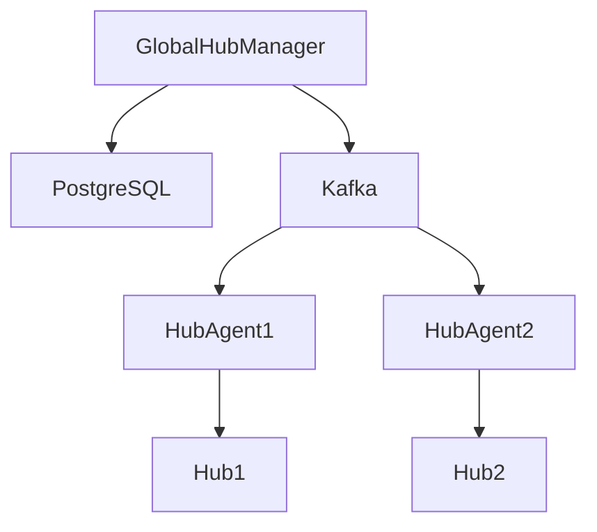

## Public Cloud, Private Cloud e Hybrid Cloud

### Capire il contesto prima di parlare di RHACM

Ragazzi, prima di entrare in RHACM, dobbiamo capire *dove vive* Kubernetes nelle aziende reali.
Oggi non esiste quasi nessuna azienda che sia 100% on-prem o 100% public cloud. La realtà è ibrida, distribuita, regolamentata, vincolata da costi e sicurezza. RHACM nasce proprio per governare questa complessità.

---

## Public Cloud

Quando parliamo di public cloud intendiamo provider come AWS, Azure, Google Cloud: infrastruttura e servizi accessibili a chiunque, su richiesta, pagando solo ciò che si usa.

**I vantaggi sono enormi:**

* Scalate un’applicazione in minuti, non settimane.
* Non comprate server, non fate investimenti iniziali: tutto è pay-per-use.
* Avete servizi già pronti per AI, machine learning, database gestiti, storage distribuito globale.
* Potete distribuire l’applicazione in data center in tutto il mondo.

Ma ci sono dei problemi:

**“What about existing workloads?”**

Pensiamo a un’azienda che ha un gestionale scritto dieci anni fa, che gira su una VM Windows 2012 con un database SQL installato a mano. Non è un workload che “prendi e sposti”.
Nel cloud può funzionare ma devi creare tutto l'environment ma soprattutto: devi chiederti se ha senso spostarlo o se è meglio lasciarlo dov’è.

**“What are the migration costs?”**

Per migration coste non è solo la VM su AWS ma il tempo degli ingegneri, i test, le notti di cut‑over, i rollback.
La migrazione è un progetto, non un copia‑incolla.

**“I have lots of legacy systems!”**

E qui arriva la parte più delicata. Perchè il cloud non ti svecchia automaticamente le applicazioni. Se non sono supportate, tali rimangono anche sul cloud. Ma attenzione spoiler, openshift virtualization potrebbe salvarvi la vita

**“What are the operational costs?”**

Qui molti scoprono la realtà dopo il primo mese di fattura.
Nel datacenter on‑prem paghi l’hardware una volta e poi lo ammortizzi.
Nel cloud paghi ogni ora, ogni GB, ogni request.

**“Are they compliant with GDPR?”**

I cloud provider offrono strumenti conformi, ma la responsabilità finale è sempre dell’azienda.
Se metti dati sensibili in una regione sbagliata, o li replichi negli Stati Uniti senza accorgertene, non è il cloud a essere non conforme: è la configurazione.

**“I’m concerned about security!”**

E qui c’è un paradosso interessante. Il cloud è, in media, più sicuro dell’on‑prem.
Ma è anche più facile sbagliare. Un bucket S3 lasciato pubblico, una chiave API hardcoded, un firewall troppo permissivo…

Per applicazioni nuove, nate per il cloud (le cosiddette *cloud-native*), il public cloud è spesso la scelta più rapida e naturale.

---

## Private Cloud

Il private cloud porta gli stessi concetti del public cloud, ma in un ambiente *privato*, controllato dall’azienda: nel proprio data center, o in un’infrastruttura dedicata, non condivisa con altri clienti.

**Il limite principale?**

**“What if I’m not able to handle requests with my servers?”**

Il private cloud non scala “a piacere”: scala finché hai hardware.
Il cloud pubblico ti salva con l’elasticità; il private cloud no.

**“I need senior infrastructure roles to manage it!”**

Un private cloud non è un VMware con un’interfaccia carina: richiede competenze profonde.

** Costi iniziali molto alti (CapEx)**

Il private cloud è come comprare un ristorante invece di andare a cena fuori.
Devi pagare subito: server, storage, switch, rack, UPS, licenze, manutenzione.

**Hardware lifecycle e refresh ogni 3–5 anni**

Il cloud pubblico aggiorna l’hardware per te.
Nel private cloud, dopo 4 anni i server sono obsoleti, l’energia costa di più, le performance calano.

**Single point of failure organizzativo**

Nel cloud pubblico hai team globali 24/7.
Nel private cloud, se il tuo senior engineer è in ferie e succede un disastro… buona fortuna.
Esempio: un guasto allo storage alle 3 di notte → nessuno risponde → downtime di ore.

---

## 5 I benefici dell’hybrid cloud

* **Alta disponibilità**: se un ambiente ha un problema, l’altro può subentrare.
* **Servizi specializzati**: ogni workload gira dove ha senso.
* **Data residency e compliance**: i dati restano dove devono stare.
* **Latenza bassa**: avvicinate cluster agli utenti.
* **Workload real-time**: app che devono rispondere in millisecondi.
* **Scalabilità mirata**: scale dove serve, non ovunque.

## 6: I challenges del hybrid cloud

L’hybrid cloud è un vantaggio strategico, ma porta inevitabilmente a gestire molti cluster, in ambienti diversi, con requisiti diversi.

Infatti, qui osserviamo la transizione da un ambiente di sviluppo locale su un singolo cluster dove va gestita "solo" la promozione tra i vari ambienti e le relative configurazioni, verso un ambiente multi-cluster dove
emergono già alcune difficoltà. Esempio:

* Deploy allineato tra più clusters e anche HA
* Policy consistenti tra i clusters
* Ma anche tracciamento delle risorse. Ad esempio, se volessi agire solo sulle risorse con una label x,y

Tutto questo diventa più complesso se il multicluster è ibrido, qui avremo:

* più copie dell'applicazioni in aree geografiche diverse
* policy di sicurezza che possono essere diverse a seconda della regione
* Non tutti i cluster sono sempre raggiungibili. Bisogna tollerare disconnessioni temporanee, edge, cluster offline.
* consistenza dati e quindi sincronizzazione

Infine serve un centro di controllo unico per la gestione dei nodi. Non possiamo usare le singole console dei cluster openshift altrimenti avremo dei drift di configurazione

---

## 7. RHACM non crea l’hybrid. Lo rende *governabile*.

✅ **Diventa il punto di controllo centrale (Hub)** per:

* vedere tutti i cluster Kubernetes / OpenShift
* applicare policy di sicurezza e compliance
* fare audit e reporting
* garantire coerenza operativa
* orchestrare la flotta di cluster come se fosse un unico sistema logico

---

## 8. Vista di insieme

In fondo abbiamo RHEL e RHEL CoreOS. Non è un dettaglio: Red Hat controlla anche il sistema operativo. CoreOS è immutabile e pensato per l’automazione, ed è il primo passo per avere cluster stabili e aggiornabili in modo coerente.

Subito sopra c’è Kubernetes. OpenShift non lo sostituisce: lo prende come standard e ci costruisce sopra.

Nel livello OpenShift Core troviamo tutto ciò che rende Kubernetes realmente “enterprise”: networking, ingress, registry, monitoring, aggiornamenti, operatori.
Qui OpenShift risolve i problemi del day-2 operations, cioè gestione, sicurezza e lifecycle del cluster.

Salendo, entriamo nella parte di piattaforma applicativa.
OpenShift non serve solo a far girare container, ma anche a sviluppare e gestire applicazioni: CI/CD, service mesh, database, runtime, fino agli strumenti per gli sviluppatori come CLI e IDE.
È il punto di incontro tra ops e developer.

Fin qui, però, stiamo parlando di un singolo cluster.

In alto entra RHACM.

RHACM risponde alla domanda:
“Cosa succede quando ho molti cluster?”
On-prem, cloud pubblico, ambienti gestiti, tutti diversi.

RHACM fornisce gestione multi-cluster: discovery, provisioning, policy, compliance e distribuzione dei workload in modo centralizzato.
Non sostituisce OpenShift: lo coordina.

## Vai su bookshelf

## Extra  RHACM Multicluster Global Hub (concetto introduttivo)

### Cosa fa il **Global Hub**

Il Global Hub interviene quando serve **una vista unica e un governo uniforme su tutti gli ambienti**, ma a livello *macro*, non sui dettagli di ogni cluster.

Immaginate l’architettura come una **gerarchia di controllo**:

* **Managed Cluster** → governati dal loro Hub locale
* **Hub locale** → governa i cluster della sua area (regione, datacenter, stabilimento)
* **Global Hub** → non governa direttamente i cluster, ma **governa gli Hub**, per avere controllo centralizzato su scala enorme

📌 **Global Hub = Hub dei Hub**

---
                                          

> “Il Global Hub non entra nei dettagli dei cluster, ma tiene insieme la governance dell’intera flotta: compliance globale, inventario, trend e stato degli Hub locali.”

**Quali aspetti verranno gestiti dal Global Hub?**

* Reporting di conformità *aggregato*
* Inventory/Fleet view dei cluster e degli Hub
* Trend di compliance
* Stato di salute dei Managed Hub
* Dashboard di osservabilità globali
* Sicurezza della comunicazione tra gli Hub
* Vista unificata per audit

**Quali aspetti verranno gestiti dai singoli Hub?**

* Installazione policy controllers sui managed cluster
* Enforcement delle policy
* Fix/Remediation automatiche
* Gestione operator OLM sui cluster
* RBAC e governance puntuale delle risorse K8s
* Raccolta eventi di violazione
* Stato dettagliato di compliance per cluster/namespace/risorsa

### Use case tipici

* Compliance globale
* Reporting centralizzato
* Inventory di cluster
* Audit-ready environment

📌 **Esempio**
Istituto finanziario con audit globali e policy uniformi.

👉 **Riassunto orale**:

> “Gli Hub locali sono i motori della governance: installano controller, applicano policy ai cluster, fanno enforcement e remediation.”

---

### ✨ Frase pronta da usare in aula

> “Il Global Hub governa gli Hub, non i cluster. Gli Hub locali governano i cluster, non l’azienda intera.”

---

Se vuoi, posso anche trasformare tutto in:

* speaker notes per Google Slides
* scaletta per animazione del flusso Global ↔ Local Hub

Pronto quando vuoi 🚀

---

## 10. Perché RHACM esiste (evoluzione storica)

| Strumento     | Limite                                                |
| ------------- | ----------------------------------------------------- |
| KubeFed       | troppo complesso, poco scalabile                      |
| Script custom | fragili, non auditabili                               |
| Tool isolati  | non danno visione globale                             |
| **RHACM**     | nasce per essere enterprise, scalabile, policy-driven |

Con la crescita dei ruoli **SRE, DevOps, DevSecOps**, l’esigenza è diventata:

* automazione
* policy-as-code
* governance uniforme
* osservabilità globale
* reporting compliance

---

## 11. Summary orale (da ripetere agli studenti)

> * Un cluster non basta
> * Più cluster creano complessità
> * RHACM riduce la complessità con governance centralizzata
> * Il concetto di Hub e Global Hub scala la gestione

---

Se vuoi, posso anche fornirti:

* versione **per speaker notes delle slide**
* script **timing per l’esposizione orale**
* check di concetti per quiz a fine capitolo

Quando vuoi 👨‍🏫
