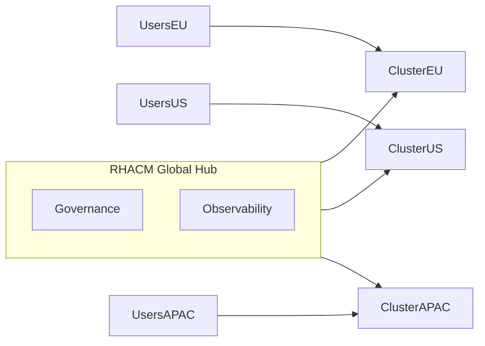
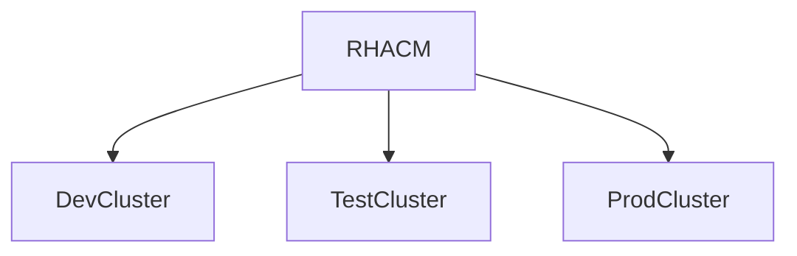
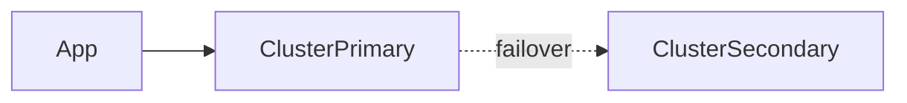
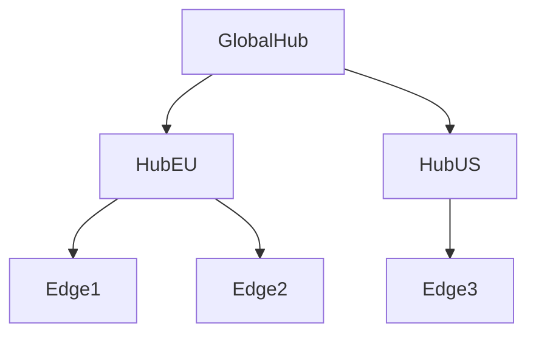
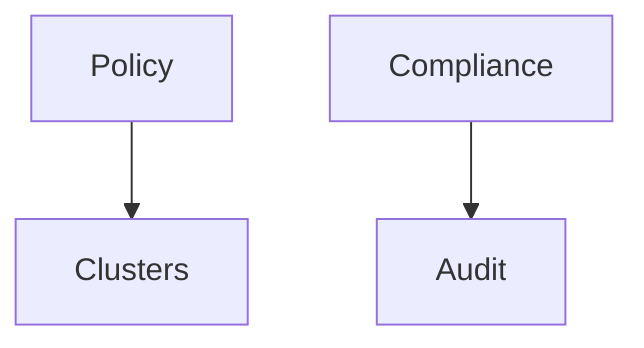
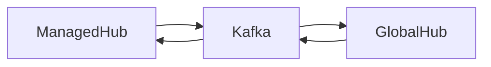
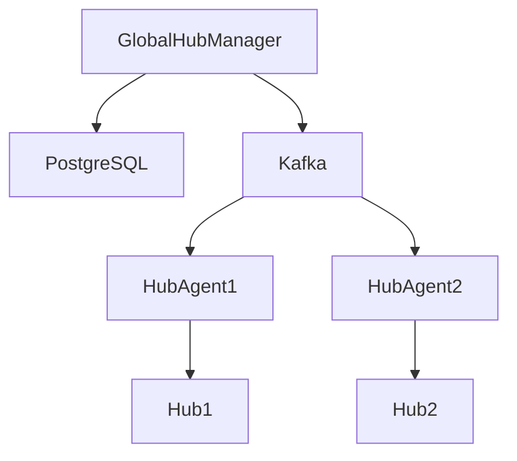

# Use Cases per l’utilizzo di RHACM (Advanced Cluster Management)

## Gestione di Ambienti Kubernetes Multicluster e Hybrid Cloud

---

## 1️⃣ Perché usare più cluster Kubernetes

Le aziende moderne **non usano un solo cluster Kubernetes**, ma **decine, centinaia o migliaia**, per motivi tecnici, organizzativi e normativi.

RHACM nasce **esattamente** per gestire questo scenario.

---

## 2️⃣ Use case principali per ambienti multicluster

### 2.1 Distribuzione geografica (Geographic Distribution)

#### Problema

* Latenza elevata per utenti globali
* Vincoli di **data residency** (es. GDPR)
* Requisiti di prossimità geografica

#### Soluzione

Distribuire cluster Kubernetes **per regione geografica**.

#### Ruolo di RHACM

* Governance centralizzata
* Policy uniformi
* Visibilità globale

📌 **Esempio**
Catena retail globale con cluster locali per e-commerce, inventario e dati clienti.

---

### 2.2 Segmentazione dei workload (Workload Segmentation)

#### Problema

* Mescolare **dev, test e prod** aumenta i rischi
* Errori in test possono impattare la produzione

#### Soluzione

Cluster dedicati per tipologia di workload.

| Cluster | Scopo           |
| ------- | --------------- |
| Dev     | Sperimentazione |
| Test    | Validazione     |
| Prod    | Servizi critici |

#### Ruolo di RHACM

* Policy diverse per ambiente
* Enforcement più rigido in produzione
* Audit centralizzato

📌 **Concetto chiave**

> *Isolare i cluster è più semplice che isolare i namespace.*

---

### 2.3 Alta disponibilità e Disaster Recovery

#### Problema

* Un singolo cluster è un **single point of failure**
* Outage regionali o di provider

#### Soluzione

Distribuire applicazioni su più cluster.

#### Ruolo di RHACM

* Monitoraggio dello stato dei cluster
* Policy di coerenza
* Supporto a strategie DR multicluster

📌 **Esempio**
Azienda logistica che sposta il traffico sul public cloud in caso di outage on-prem.

---

### 2.4 Scalabilità operativa (Fleet Management)

#### Problema

* Un singolo hub non scala per **migliaia di cluster**
* Edge computing e IoT moltiplicano i cluster

#### Soluzione

**Gerarchia di hub** con Global Hub.

#### Ruolo di RHACM

* Global Hub per coordinare più hub
* Gestione scalabile
* Riduzione del carico operativo

📌 **Esempio reale**
Telco con migliaia di cluster edge per servizi 5G.

---

## 3️⃣ Sfide degli ambienti multicluster (e come RHACM le risolve)

### 3.1 Portabilità delle applicazioni

#### Problema

* Cloud provider diversi
* Architetture diverse (x86, ARM, Power)

#### Soluzione RHACM

* Supporto multipiattaforma
* Deploy coerente via policy e GitOps

---

### 3.2 Sicurezza e compliance

#### Problema

* Policy incoerenti
* Normative diverse per regione

#### Soluzione RHACM

* Policy centralizzate
* Comunicazioni HTTPS
* Certificati e secret gestiti

---

### 3.3 Networking e connettività

#### Problema

* Cluster in reti diverse
* Firewall, NAT, provider differenti

#### Soluzione RHACM

* Comunicazione standardizzata HTTPS (443)
* Integrazione Kafka / PostgreSQL

---

### 3.4 Sincronizzazione dei dati

#### Problema

* Stato e compliance non allineati
* Ritardi negli aggiornamenti

#### Soluzione RHACM

* Kafka per trasporto dati
* PostgreSQL per persistenza

---

## 4️⃣ RHACM Multicluster Global Hub – Use case avanzato

### Architettura logica

### Use case tipici

* Compliance globale
* Reporting centralizzato
* Inventory di cluster
* Audit-ready environment

📌 **Esempio**
Istituto finanziario con audit globali e policy uniformi.

---
 